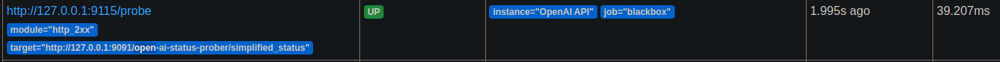
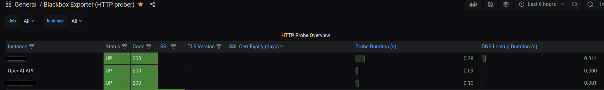

# OpenAI API Status Prober

[](https://badge.fury.io/js/openai-api-status-prober)


This is a simple web service that you can use to probe openAI API status and integrate it into your prometheus server.

See it in action:
https://openai-api-status-prober.onrender.com/open-ai-status-prober/simplified_status





## Table of Contents

- [Why](#why)
- [Installation](#installation)
- [Integrating into Prometheus Server](#integrating-into-prometheus-server)
- [CLI Commands](#cli-commands)

## Why?

Because the [official API](https://status.openai.com/api/v2) for probing/fetching the API status of the openAI returns HTTP code 200 whether it's down or up. But for Prometheus Blackbox exporter, you need an endpoint that can return 200/500/3xx depending on the status.

This little prober works as a proxy for the actual [openAI API status](https://status.openai.com/api/v2) and translates its response to corresponding HTTP response status codes, this way you can easily integrate openAI as a target for your Prometheus Blackbox exporter.


## Installation


There is three different methods as to consume this API.
1. [Global installation (TL;DR get it working ASAP)](#global-installation)
2. [Local Installation](#2-local-installation)
3. [Use production deployment directly (please don't overload)](#use-production-deployment-directly)

Following the installation, move on with [integrating it into your Prometheus](#integrating-into-prometheus-server).

<a name="global-installation"></a>
### 1. Global installation (TL;DR get it working ASAP)

0. Install `pm2`, this method relies on [PM2](https://pm2.keymetrics.io/) to start and keep itself running.

```bash
npm install -g pm2
```

1. Install the package **globally**

```bash
npm install -g openai-api-status-prober
```

2. Start the service

Serve it via `pm2`:
```bash
openai-api-status-prober start
```

Set `pm2` as a system service (if you haven't already):
```bash
pm2 startup
```

Save `pm2` configuration and jobs
```bash
pm2 save
```

3. Enjoy

You may access the API via default port (9091) and default endpoint (/open-ai-status-prober/simplified_status). For your local, that would be: 

http://localhost:9091/open-ai-status-prober/simplified_status

---

### 2. Local Installation

0. Clone or download the repository

```bash
git clone https://github.com/skywarth/openai-api-status-prober.git
```

```
cd openai-api-status-prober
```

1. Install the dependencies

`npm ci` or `npm install`

2. (Optionally) Configure environment

`cp .env.example .env`

Then change the port and the endpoint as you wish.

3. Run the server

```bash
node src/server.js` 
```

<a name="use-production-deployment-directly"></a>
### 3. Use production deployment directly

You may hook up the deployment on https://openai-api-status-prober.onrender.com/open-ai-status-prober/simplified_status directly if you wish. 
But don't do this unless it is imperative, or you're simply not able to self-host.


## Integrating into Prometheus Server

After you're through with the [installation](#installation), you may proceed with integrating it into your prometheus job as a probing target.

Determine the serving point of this server, if you didn't customize the env that would be:
> http://127.0.0.1:9091/open-ai-status-prober/simplified_status

Prometheus Blackbox Exporter expects a URL for each probing target. Therefore, directly hook this server's endpoint URL as blackbox exporter target.

*Tip: you may find your prometheus config at `/etc/prometheus/prometheus.yml`*

```yaml
#other jobs and configs...
scrape_configs:
  - job_name: 'blackbox'
    metrics_path: /probe
    params:
      module: [http_2xx]  # Look for an HTTP 200 response.
    static_configs:
      - targets:
        - http://prometheus.io 
        - https://some-other-target-of-yours.io
        - http://127.0.0.1:9091/open-ai-status-prober/simplified_status # Focus here, this is your OpenAI Status integration point
    relabel_configs:
      - source_labels: [__address__]
        target_label: __param_target
      - source_labels: [__param_target]
        target_label: instance
      - target_label: __address__
        replacement: 127.0.0.1:9115  # The blackbox exporter's real hostname:port.
  - job_name: 'blackbox_exporter'  # collect blackbox exporter's operational metrics.
    static_configs:
      - targets: ['127.0.0.1:9115']
#other jobs and configs...
```

In the configuration above, we've only added our OpenAI API Status prober into the targets, no other change is necessary.

To reload your Prometheus configuration, simply restart the Prometheus service.
Use `sudo` if necessary. (This method may vary depending on the system and prometheus installation.)

```bash
$ systemctl restart prometheus 
```

Navigate to the prometheus server dashboard and see your new target getting probed. Cheers!

### Delving deeper into probe targets

Since this new target of yours for the OpenAI API status is served and probed via a `localhost` or a local IP address, this may look ugly on your Grafana Dashboard when you pair it with Prometheus Server.

To overcome this pickle, you may relabel your Prometheus Blackbox exporter targets to display proper labels in your Grafana Dashboard. Although application method for this may vary, here's how I usually do it:

```yaml
# rest of the Prometheus configuration
- job_name: 'blackbox'
    metrics_path: /probe
    params:
      module: [http_2xx]
    static_configs:
      - targets:
        - http://127.0.0.1:9091/open-ai-status-prober/simplified_status
        labels:
          instance: 'OpenAI API'
      - targets:
        - https://github.com
        labels:
          instance: 'Github'
    relabel_configs:
      - source_labels: [__address__]
        target_label: __param_target
      - target_label: __address__
        replacement: 127.0.0.1:9115  # Blackbox Exporter's address
# rest of the Prometheus configuration
```

See the difference? We introduced a new label `instance` for each target which allows us to utilize it for the display purposes.
This way our Grafana Dashboard would effectively display the labels we've designated rather than the addresses of each target.


### A word on Grafana Dashboard

Personally, I find this Grafana Dashboard setup to be rather enjoyable, so I can suggest it:
https://grafana.com/grafana/dashboards/13659-blackbox-exporter-http-prober/

The `prometheus.yml` configuration I've provided above also fits nicely for this dashboard.


## CLI commands

This small app comes packed with some cli commands. These commands are tailored for global installation. Here's the list:

### Start server

Starts the express.js server via `pm2`, also saves the current PM2 config by issuing `pm2 save`

`openai-api-status-prober start`

### Stop server

Stop the server, and save the current state of PM2. Keeps the current tab/job in the PM2, only stops it.

`openai-api-status-prober stop`


### Remove server

Remove the server from PM2 job configuration and save the current PM2 config. 

Use this if you would like to remove the running job/thread for the app

`openai-api-status-prober detach`


### Version

Outputs package version

`openai-api-status-prober -v` or `openai-api-status-prober --version`

### Env path

Outputs the env path for the package

`openai-api-status-prober env-path`
